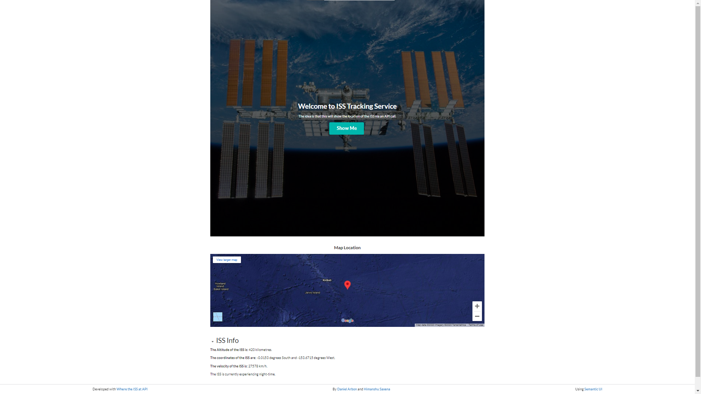
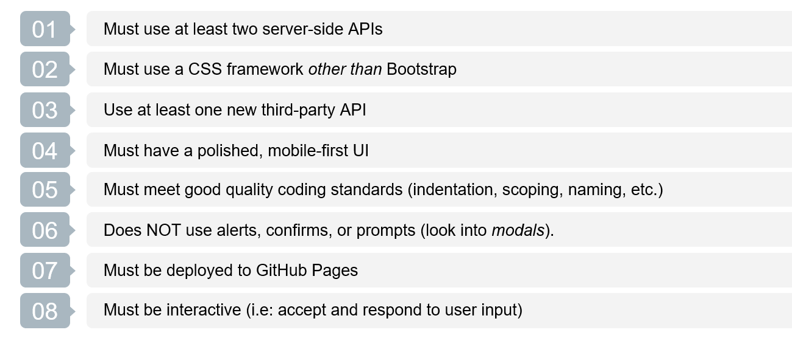

# BCS Project 1: ISSInternation Space Station Tracking Website
This is for work and files relating to the BootCampSpot Project 1. This is for the Adelaide August cohort Team Damaged Turtle Flu (Daniel Arbon and Himanshu Saxena).

The topic we have decided to work on is a page that allows the visitor to locate the International Space Station. It does this via an API provided by [Where the ISS At](http://www.wheretheiss.at). When the user clicks a button, the coordinates from this API call are then displayed on an embedded Google Map frame (courtesy of the Google Maps Embedded API). An additional collapsible set of paragraph elements contains additional information from the ISS position API, including altitude, velocity, and whether it is on the day or night side of the planet. This information is refreshed every time the user clicks the "Show Me" button.

CSS styling and layout is achieved through use of the Semantic UI framework.

## Website Deployment
The ISS Tracking site can be found [here](http://arbdt.github.io/bcs-project-1).

## Sample Image

#### Project Criteria

